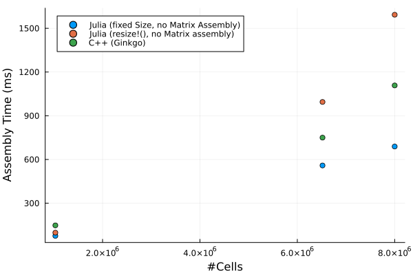

# FVM-Prototyping

**First Milestone:** Translating the [C++ Prototype](https://github.com/chihtaw/FVM-CFD-prototype ) into Julia ✔️

TODOs:
- Refactor Project structure yet again so that the assembly method is plug n' play and can be separately benchmarked ✔️
- stability ✔️ (probably :tm: )


# Initial Benchmarks

Cases: 
1. Lid-Driven Cavity S (1M x 1M Mesh)
2. Lid-Driven Cavity M (8M x 8M Mesh)
3. Windsor Body        (6M x 6M Mesh)

## Assembly Time
    
   


## Memory Usage

> TODO: add figures about memory usage

> Hypothesis: Shows that julia is currently bottlenecked by the GC


# TODO 
- assembly time pro zelle normieren
- wie viele faces werden iteriert
- wie viele cellen sind im netz
- "wie viel speicher bewege ich", i.e., wie viel speicher wird *insgesamt* verbraucht
    - worst case performance model: "in dem loop lade ich so und so viele byte.."
- theoretisch das runtime geraffel von c++ testen

- scheme erst zu runtime verfügbar


## New benchmark data

> Key difference: Using cheap preprocessing to remove resizing

### Updated Julia Version on windsor body:


- Calculation Time: 994ms -> 559ms (down ~40%)
- Memory estimate: 4.64Gib -> 893Mib (down ~80%)
- Mean GC Time: 58% -> 7%  (down ~88%)
- Allocations 2361499 -> 1832069 (down ~22%)


```
julia> @benchmark  CellBasedAssembly($input)
BenchmarkTools.Trial: 9 samples with 1 evaluation per sample.
 Range (min … max):  496.400 ms … 620.800 ms  ┊ GC (min … max):  0.00% … 0.00%
 Time  (median):     559.436 ms               ┊ GC (median):    10.64%
 Time  (mean ± σ):   567.838 ms ±  36.256 ms  ┊ GC (mean ± σ):   7.00% ± 7.04%

  █▁▁▁▁▁▁▁▁▁▁▁▁▁▁▁▁▁▁▁▁▁▁▁▁▁▁▁▁██▁▁▁▁▁▁██▁▁▁▁▁▁▁▁▁▁▁▁▁▁▁▁▁▁█▁▁█ ▁
  496 ms           Histogram: frequency by time          621 ms <

 Memory estimate: 893.90 MiB, allocs estimate: 1832069.
```


### Updated Julia Version on LDC-M:

- Calculation Time: 1593 -> 689 (down ~55%)
- Memory estimate: 4.65Gib -> 1.09Gib (down ~75%)
- Mean GC Time: 59% -> 6.86%  (down ~88%)
- Allocations 2481521 -> 1687177 (down ~32%)


```
BenchmarkTools.Trial: 8 samples with 1 evaluation per sample.
 Range (min … max):  641.623 ms … 779.803 ms  ┊ GC (min … max): 0.00% … 12.91%
 Time  (median):     689.761 ms               ┊ GC (median):    6.56%
 Time  (mean ± σ):   697.340 ms ±  59.643 ms  ┊ GC (mean ± σ):  6.86% ±  6.81%

  █▁▁▁▁▁▁▁▁▁▁▁▁▁▁▁▁▁▁▁▁▁▁▁▁▁▁▁▁▁▁▁▁▁▁▁▁▁▁▁▁▆▁▁▁▆▆▁▁▁▁▁▁▁▁▁▁▁▁▁▆ ▁
  642 ms           Histogram: frequency by time          780 ms <

 Memory estimate: 1.09 GiB, allocs estimate: 1687177.
```


### Updated Julia Version on LDC-S:

- Calculation Time: 97 -> 76 (down ~22%)
- Memory estimate: 488Mib -> 145Mib (down ~70%)
- Mean GC Time: 54% -> 12.47%  (down ~75%)
- Allocations 600289 -> 420273 (down ~3%)


```
BenchmarkTools.Trial: 64 samples with 1 evaluation per sample.
 Range (min … max):  65.301 ms … 102.484 ms  ┊ GC (min … max):  0.00% … 34.05%
 Time  (median):     76.138 ms               ┊ GC (median):     0.00%
 Time  (mean ± σ):   79.128 ms ±  11.908 ms  ┊ GC (mean ± σ):  12.47% ± 13.40%

  █                    █                              ▂         
  █▆█▁▅▃▃▁▁▁▁▁▁▁▁▁▁▁▁▃▅█▁▅▁▁▁▁▁▁▁▁▁▁▁▁▁▁▁▁▁▁▁▁▁▁▁▁▃▆▁▅█▅▃▆▅▅▁▅ ▁
  65.3 ms         Histogram: frequency by time         95.7 ms <

 Memory estimate: 145.11 MiB, allocs estimate: 420273.
```