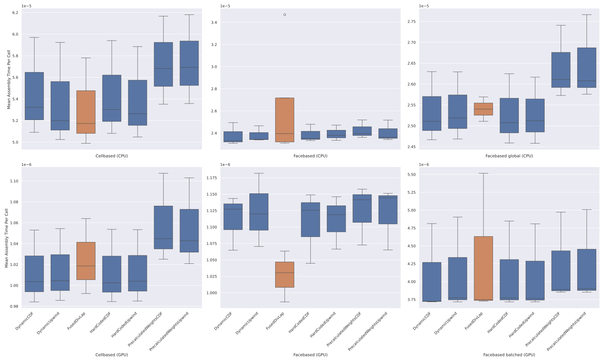

# FVM-Prototyping

# Initial Benchmarks

Cases: 
1. Lid-Driven Cavity S (1M x 1M Mesh)
2. Lid-Driven Cavity M (8M x 8M Mesh)
3. Windsor Body        (6M x 6M Mesh)

# Assembly Time, Normed by #Cells (Matrix Diagonal)

   