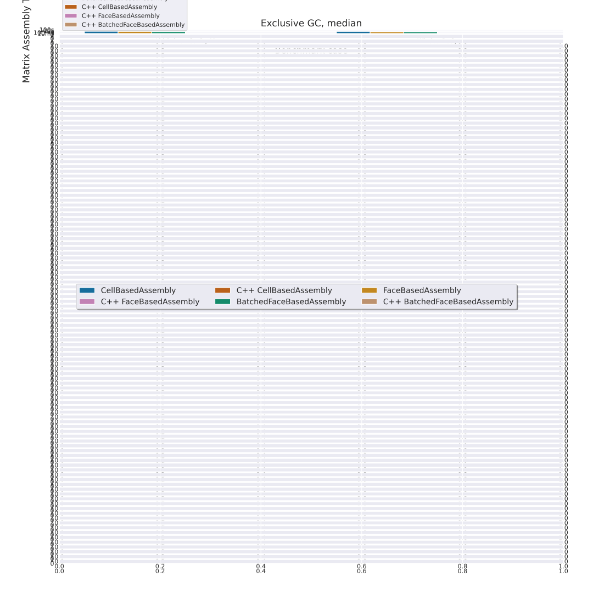
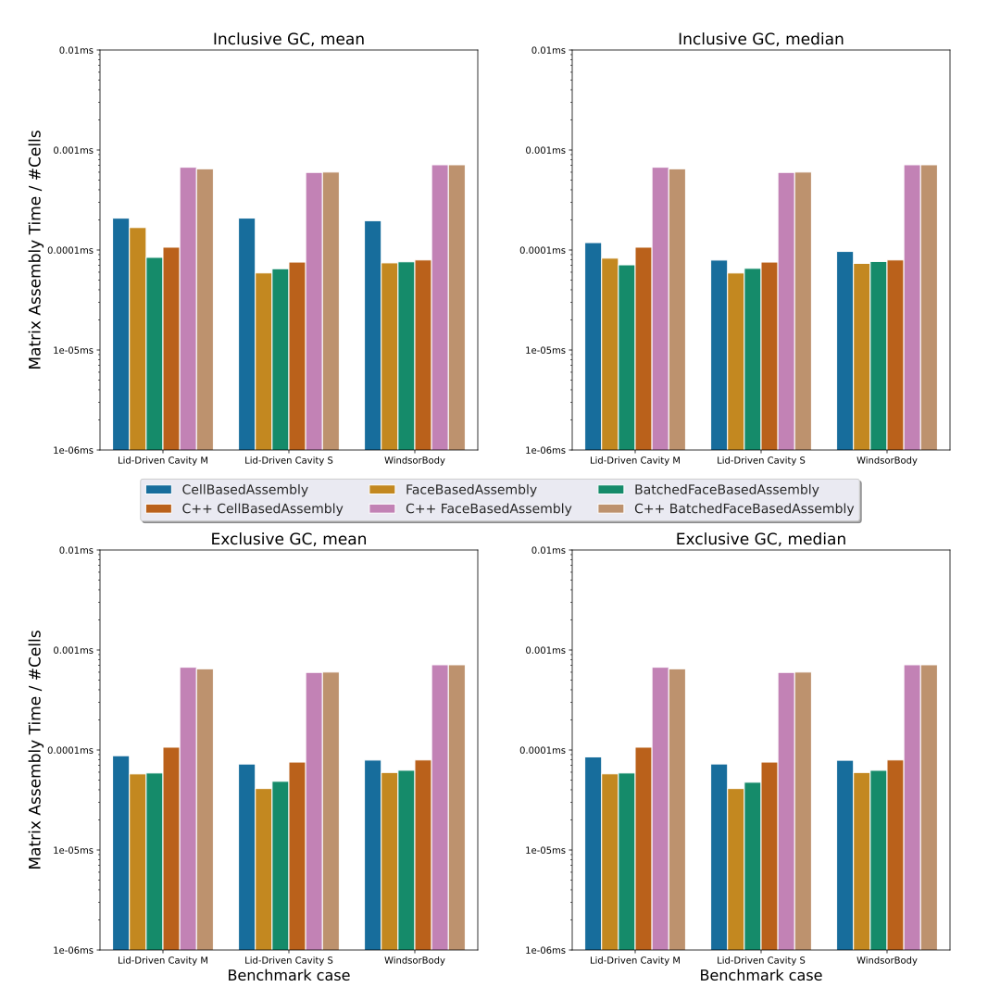
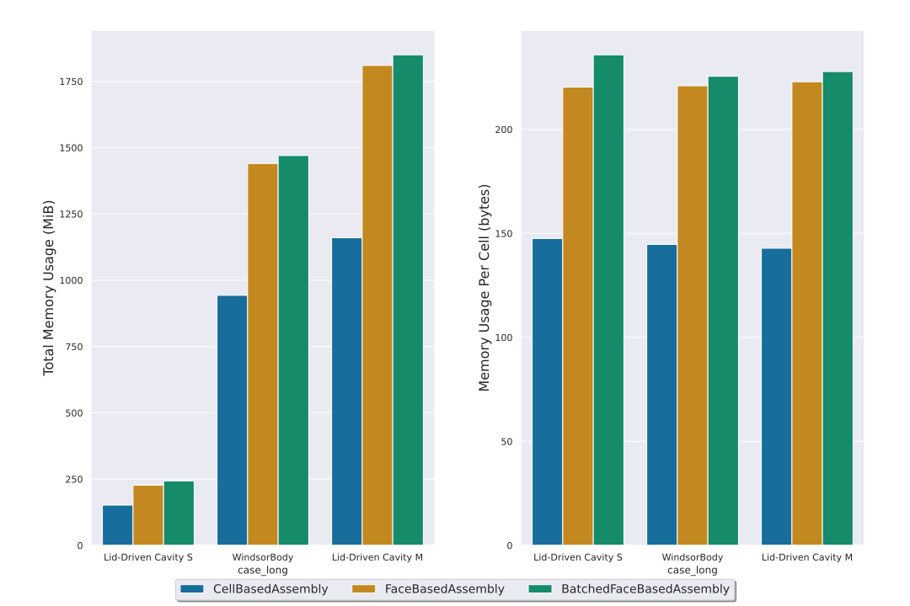

# FVM-Prototyping

# Initial Benchmarks

Cases: 
1. Lid-Driven Cavity S (1M x 1M Mesh)
2. Lid-Driven Cavity M (8M x 8M Mesh)
3. Windsor Body        (6M x 6M Mesh)

## Assembly Time
    
   

## Assembly Time, Normed by #Cells (Matrix Diagonal)

   


## Memory Usage

   

## Single Kernel vs Split kernel (facebased strategy)

(putting this here for now)

### Windsorbody
> Single Kernel with internal/boundary branch:

BenchmarkTools.Trial: 3230 samples with 1 evaluation per sample.
```
 Range (min … max):  1.502 ms …   9.674 ms  ┊ GC (min … max): 0.00% … 0.00%
 Time  (median):     1.522 ms               ┊ GC (median):    0.00%
 Time  (mean ± σ):   1.545 ms ± 150.327 μs  ┊ GC (mean ± σ):  0.00% ± 0.00%
```
> Two Kernels without branching:
```
BenchmarkTools.Trial: 287 samples with 1 evaluation per sample.
 Range (min … max):  17.267 ms …  26.060 ms  ┊ GC (min … max): 0.00% … 0.00%
 Time  (median):     17.437 ms               ┊ GC (median):    0.00%
 Time  (mean ± σ):   17.461 ms ± 512.539 μs  ┊ GC (mean ± σ):  0.00% ± 0.00%
```

### Lid-Driven Cavity M
> Single Kernel with internal/boundary branch:
```
BenchmarkTools.Trial: 3209 samples with 1 evaluation per sample.
 Range (min … max):  1.500 ms …  12.815 ms  ┊ GC (min … max): 0.00% … 0.00%
 Time  (median):     1.514 ms               ┊ GC (median):    0.00%
 Time  (mean ± σ):   1.556 ms ± 225.870 μs  ┊ GC (mean ± σ):  0.00% ± 0.00%
```

> Two Kernels without branching:
```
BenchmarkTools.Trial: 397 samples with 1 evaluation per sample.
 Range (min … max):  12.202 ms …  28.999 ms  ┊ GC (min … max): 0.00% … 0.00%
 Time  (median):     12.376 ms               ┊ GC (median):    0.00%
 Time  (mean ± σ):   12.603 ms ± 910.797 μs  ┊ GC (mean ± σ):  0.00% ± 0.00%
```

### Lid-Driven Cavity S
Dataset is too small (difference of <0.05ms)

### Colored Batches Strategy
```
BenchmarkTools.Trial: 104 samples with 1 evaluation per sample.
 Range (min … max):  47.989 ms … 60.630 ms  ┊ GC (min … max): 0.00% … 0.00%
 Time  (median):     48.215 ms              ┊ GC (median):    0.00%
 Time  (mean ± σ):   48.416 ms ±  1.284 ms  ┊ GC (mean ± σ):  0.00% ± 0.00%
```
```
BenchmarkTools.Trial: 104 samples with 1 evaluation per sample.
 Range (min … max):  47.683 ms … 60.834 ms  ┊ GC (min … max): 0.00% … 0.00%
 Time  (median):     48.121 ms              ┊ GC (median):    0.00%
 Time  (mean ± σ):   48.298 ms ±  1.308 ms  ┊ GC (mean ± σ):  0.00% ± 0.00%
```

Since we need to dispatch multiple kernels anyways, joining the kernel does not really make difference.